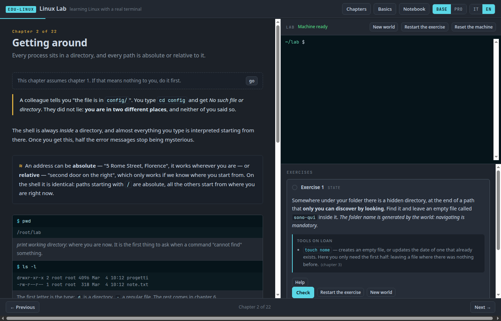
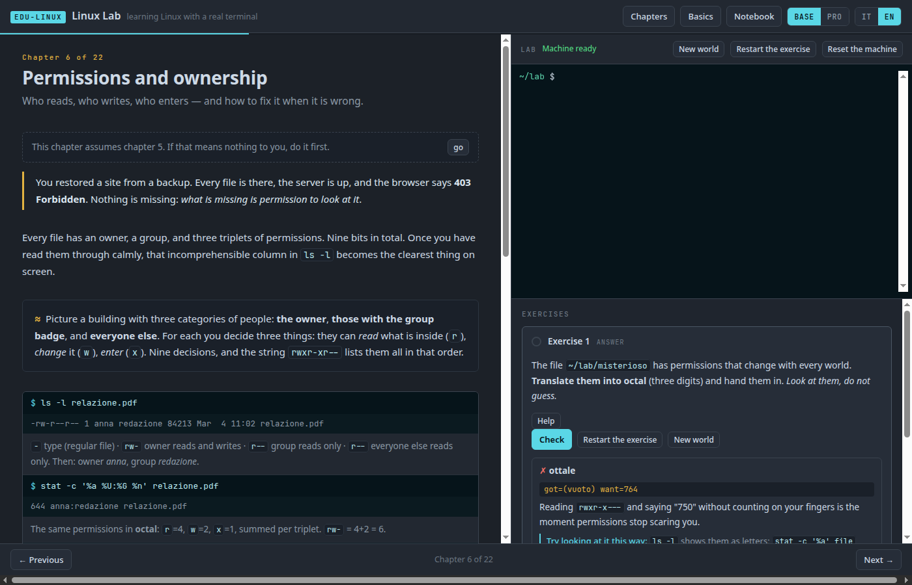
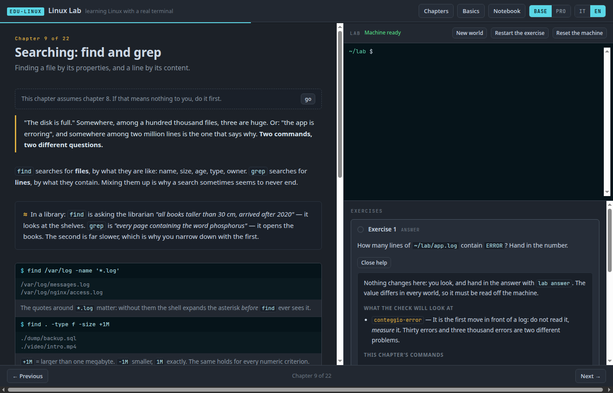
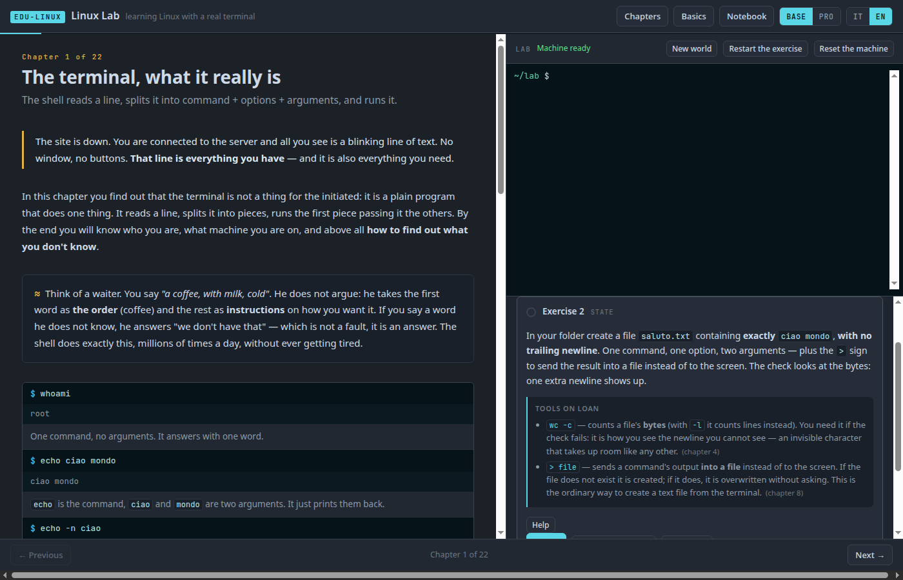

# EDU-LINUX · Linux Lab

**Learning Linux with a terminal that actually answers.**
22 chapters, from your first command line to bringing up a server.

👉 **[Try it online](https://manzolo.github.io/LinuxLab/?lang=en)** — nothing to install, no account.

[Versione italiana](README.md)

---

## What it is

Open the link and after a few seconds you have **a real Linux kernel inside your browser
tab**. Not a simulation, not a fake terminal that only answers the expected commands: it is
Linux, and you can type anything into it. Including breaking it — there is a button that puts
it back to new in half a second.

You read on the left, you try on the right. Every chapter has exercises the machine
**really checks**, by looking at how its filesystem ended up.



## When you get it wrong, we do not say "no"



Every failed check gives you three things, in this order: **the fact** measured by the machine
(`got=… want=…`), **the why** in one sentence, and **a command to look at the problem** — not
the solution. After ten exercises you are left with the reflex that is the whole trade: look
first, change second.

## And before you try, the picture



Every exercise has a help panel telling you what the check will look at and which commands you
need. The real hints stay below, and open one at a time.

## And nothing you were never told about



An exercise may use a command the lab has not taught yet — sometimes it must, because chapter 1
without the `>` sign cannot have you create a file. But then it **declares it**: what it does,
in one sentence, under the task, always open, without spending a hint. Next to it is the
chapter where you will really study it, which is there to say *"you did not miss a lesson"*.

This is not a good intention, it is a test: `npm test` builds the course's cumulative
vocabulary — what the chapters up to that point declare, show and recap — and compares it with
the commands and shell grammar appearing in the tasks and hints: redirections, `&&`, `||`, `;`,
assignments and expansions, command substitution, background jobs, `$!`, `$?`, and `wait`. It
does the same for **skills** that are not a
command: from files and tasks it infers, for example, who requires multi-line writing, and only
accepts the skill if a lesson already encountered has actually shown a heredoc, `vi`, and the
exit route. If it finds a gap, the build fails and names it. On its first run the vocabulary
found 23; the skills track made nine more visible.

## How the anti-cheat works

In this lab's sibling projects the engine is made of paper, so checking can compare outputs.
Here the engine is a kernel: there are ten legitimate ways to reach the result. The answer is
not to check harder, it is to **move the uncertainty into the world**:

> If the initial state is generated from a seed you do not know, the answer cannot be
> hardcoded — and there is no need to police the method.

The log has a different number of `ERROR` lines every session. The hidden folder has a
generated name. The five most frequent IPs cannot be typed by hand because you have never
seen them. In the scripting chapters the check **runs your script on cases you have never
seen**, and the capstone runs it on a machine reset to its initial state: if you did it all
by hand, it does not pass.

## The programme

| | Chapter | Where |
|---|---|---|
| 01 | The terminal, what it really is | 🌐 |
| 02 | Getting around | 🌐 |
| 03 | Files and folders | 🌐 |
| 04 | Reading a file | 🌐 |
| 05 | The filesystem: /etc, /var, /proc | 🌐 |
| 06 | Permissions and ownership | 🌐 |
| 07 | Users, groups, sudo | 🌐 |
| 08 | Pipes, redirection and text files | 🌐 |
| 09 | Searching: find and grep | 🌐 |
| 10 | Transforming: sed, awk, sort | 🌐 |
| 11 | Processes and signals | 🌐 |
| 12 | Packages | 🌐 |
| 13 | Disks, mounts, space | 🌐 |
| 14 | Logs and scheduled work | 🌐 |
| 15 | Networking basics | 🌐 |
| 16 | Bash scripts | 🌐 |
| 17 | systemd | 💻 |
| 18 | Networking, deeper | 💻 |
| 19 | Services: nginx and ssh | 💻 |
| 20 | Firewall and hardening | 💻 |
| 21 | LVM and RAID | 💻 |
| 22 | Capstone: bring up a server | 💻 |

🌐 = in the browser, nothing to install · 💻 = in the local lab (Docker)

The **BASE / PRO** switch sets the depth: in BASE you learn what to do, in PRO you find out
how it works underneath and what breaks. Same pages.

## Why six chapters run locally

Because you cannot fake it. In the browser, the v86 emulator runs a real Linux, but:

- **systemd wants to be PID 1 and wants cgroups**, and v86 starts a shell on a kernel that has
  neither. On top of that Alpine, the guest system, uses OpenRC and has no systemd at all.
- **real networking wants a network card**, and the browser machine has none.
- **LVM and RAID want several block devices.**

Chapters 17-22 have the same anatomy as the others, the same `seed.sh` and `check.sh`, and
the same `lab check` command. Only the executor changes. And explaining *why* they would not
work is itself chapter material: the reader learns what systemd actually needs in order to
exist.

There is one declared external prerequisite here, not hidden knowledge: Git and a running
Docker installation capable of Linux containers. The lab does not teach Docker installation
because that step differs across Linux, macOS, and Windows; before starting, it checks the
actual capabilities of the environment and reports what is missing:

```bash
git clone https://github.com/manzolo/LinuxLab && cd LinuxLab
./lab/local/run.sh check         # Docker, cgroup v2, and kernel modules
./lab/local/run.sh 17 1          # prepare the lab and the exercise
docker exec -it linuxlab bash    # get in
lab check 17 1                   # check
./lab/local/run.sh cleanup       # when you are done
```

> ⚠️ Local chapters use a `--privileged` container: in this Docker runtime systemd needs it to
> create unit cgroups. This gives container root broad access to the host kernel: only run the
> lab's commands, on a machine or VM you trust. It is not equivalent to the browser sandbox.
>
> Chapter 21 additionally creates loop devices, LVM volumes, and RAID arrays that are global
> to the Linux kernel running Docker. On native Linux, host
> `lsblk` will show them; with Docker Desktop the kernel belongs to its internal VM and chapter
> 21 may not be supported. This is why `run.sh check` comes first and everything the lab creates
> is named `lab-*`; `cleanup` unmounts and detaches it all.

## What this lab does NOT cover

Plainly: boot and bootloaders (GRUB, initramfs), kernel and modules, partitioning real disks,
virtualisation, containers as a subject of their own, permanent distribution network
configuration. Those are real, large topics and deserve more than a passing mention.

On mobile the lab is **readable but not practicable**: a terminal needs a real keyboard. The
site says so rather than letting you try and get frustrated.

## How it is built

Static site, ES modules, zero dependencies, zero build. The machine is
[v86](https://github.com/copy/v86) (BSD-2) with [xterm.js](https://github.com/xtermjs/xterm.js)
(MIT) and an Alpine rootfs we build ourselves. All open source, no CDN, no backend.

Two decisions hold up the rest:

- **One snapshot for all 22 chapters.** Cold, from 9p, the kernel takes ~46 seconds; from the
  snapshot the prompt is there in half a second. One snapshot means one URL, downloaded at the
  first chapter and a cache hit for the other 21 — and the machine stays *the same* as you
  move between chapters.
- **Content does not live inside the image.** It lives in `content/chNN/` and enters at
  runtime. Changing an exercise is a text commit, not a two-minute rebuild.

The checking channel runs over a **second serial port**, not the visible terminal: the other
way round, a command injected while you are inside `vi` would destroy your work. Measured:
during a full check, zero bytes appear on the terminal.

### Measured numbers

| | |
|---|---|
| first load | 13.5 MB |
| compressed snapshot | 10.7 MB |
| snapshot to prompt | 0.6 s in Chrome |
| full rootfs | 72 MB / 5400 files (fetched on demand, not at boot) |

## Running it locally

```bash
npm run serve          # http://localhost:8801 — read the chapters, without the terminal
```

For the terminal too you must build the image once (Docker, `zstd`, `pip install zstandard`):

```bash
make -C lab check-tools
npm run image          # ~4 minutes: rootfs + snapshot
npm run serve
```

If the image is missing, the site says so plainly instead of throwing a network error.

## Tests

```bash
npm test               # content structure: bilingual, check ids, prerequisites (seconds)
npm run audit          # commands and skills required before they are taught
npm run test:labs      # boots the REAL machine and runs every browser exercise
npm run test:labs-local # chapters 17-22, in the Debian container
npm run e2e            # smoke test on headless Chrome
```

`test:labs` runs five assertions on every exercise: the initial state does **not** already
pass, the reference solution passes **on three different seeds**, and the purpose-written
cheat **fails**. If those are green, the teaching model holds.

## Adding a chapter

```bash
npm run new-chapter -- 23 chapter-name
```

Chapters with `draft: true` are hidden from the table of contents and skipped by the tests:
you can commit a half-written chapter without breaking anything.

## Licence

MIT © Andrea Manzi ([manzolo](https://github.com/manzolo)) — see
[THIRD-PARTY.md](THIRD-PARTY.md) for component and redistributed package licences.

Part of the **EDU-\*** series: [AI Atlas](https://manzolo.github.io/AiAtlas/) ·
[EDU-SQL](https://manzolo.github.io/SqlSimulator/) ·
[EDU-NET](https://manzolo.github.io/NetworkSimulator/) ·
[EDU-GIT](https://manzolo.github.io/GitSimulator/) ·
[EDU-REGEX](https://manzolo.github.io/RegexSimulator/) ·
[EDU-CRYPTO](https://manzolo.github.io/CryptoSimulator/) — and the others, under the
[`edu-simulator`](https://github.com/topics/edu-simulator) topic.
