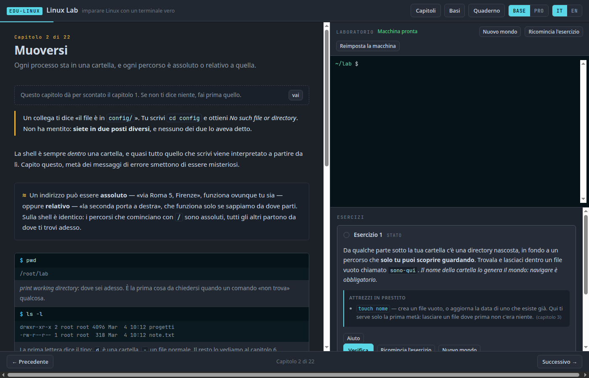
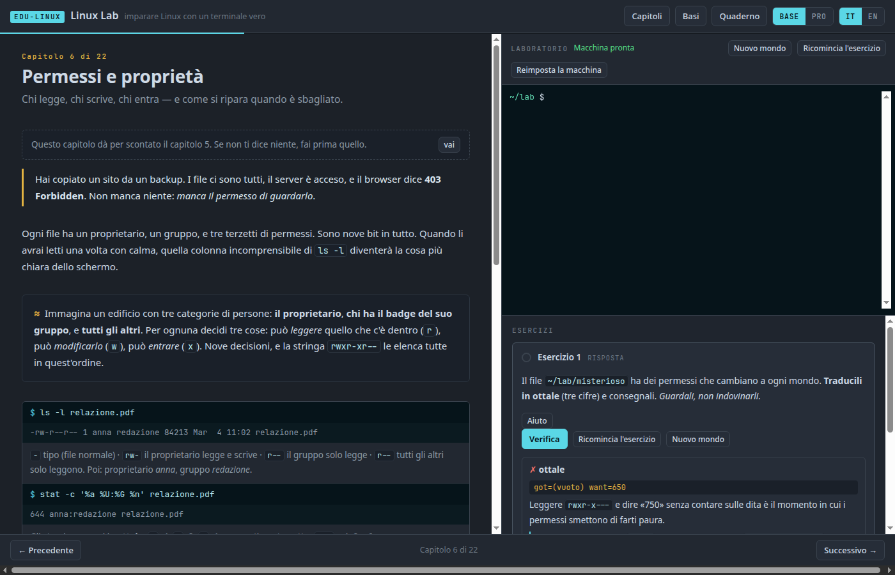
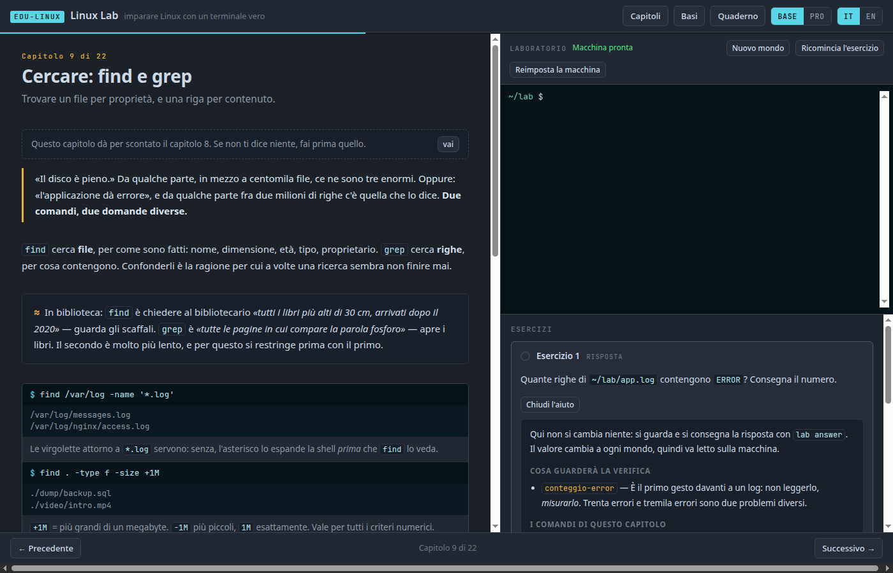
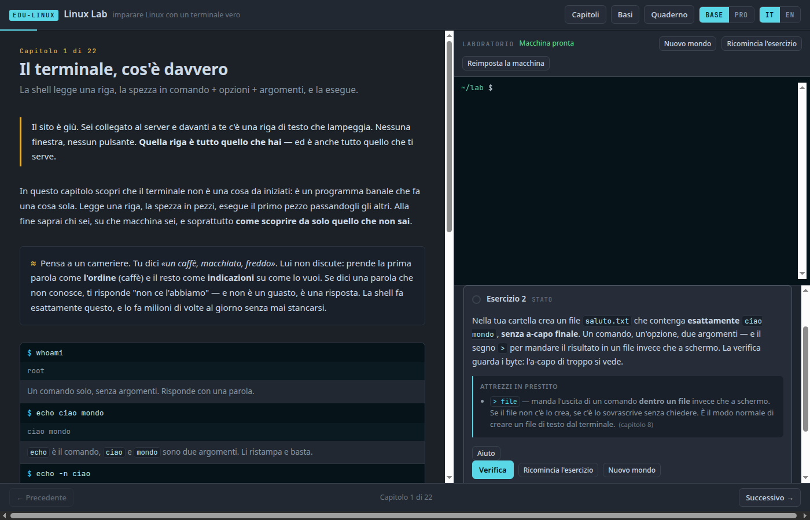

# EDU-LINUX · Linux Lab

**Imparare Linux con un terminale che risponde davvero.**
Questo è **Linux Core**: 24 capitoli, dalla prima riga di comando fino a mettere in piedi
un server — il primo di tre percorsi (vedi [I percorsi](#i-percorsi)).

👉 **[Provalo online](https://manzolo.github.io/LinuxLab/)** — niente da installare, niente account.

[English version](README.en.md)

---

## Cos'è

Apri il link e dopo qualche secondo hai **un kernel Linux vero dentro la scheda del
browser**. Non è una simulazione, non è un finto terminale che risponde solo ai comandi
previsti: è Linux, e puoi digitarci qualunque cosa. Anche romperlo — c'è un bottone che lo
rimette a nuovo in mezzo secondo.

A sinistra si legge, a destra si prova. Ogni capitolo ha esercizi che la macchina
**verifica davvero**, guardando com'è finito il suo filesystem.



## Quando sbagli non ti diciamo «no»



Ogni controllo fallito dà tre cose, in quest'ordine: **il fatto** misurato dalla macchina
(`got=… want=…`), **il perché** in una frase, e **un comando per guardare il problema** — non
la soluzione. Dopo dieci esercizi ti resta il riflesso che è tutto il mestiere: prima guardo,
poi cambio.

## E prima di provare, il quadro



Ogni esercizio ha un aiuto che dice cosa guarderà la verifica e quali comandi ti servono. I
suggerimenti veri restano sotto, e si aprono uno alla volta.

## E niente che non ti sia stato spiegato



Un esercizio può usare un comando che il lab non ha ancora insegnato — a volte deve, perché il
capitolo 1 senza il segno `>` non ti fa creare un file. Ma allora **lo dichiara**: cosa fa, in
una frase, sotto la consegna, sempre aperto, senza dover spendere un suggerimento. Accanto c'è
il capitolo dove lo studierai davvero, che serve a dire *«non ti sei perso una lezione»*.

Non è una buona intenzione, è un test: `npm test` costruisce il vocabolario cumulativo del
percorso — quello che i capitoli fino a lì dichiarano, mostrano e riepilogano — e lo confronta
con i comandi e con la grammatica shell che compaiono nelle consegne e nei suggerimenti:
redirezioni, `&&`, `||`, `;`, assegnazioni ed espansioni, sostituzione di comando, background,
`$!`, `$?` e `wait`. Fa lo stesso con le
**competenze** che non sono un comando: dai file e dalle consegne deduce, per esempio, chi
pretende la scrittura multilinea, e accetta la competenza solo se una lezione già incontrata ha
mostrato davvero heredoc, `vi` e la via d'uscita. Se trova un buco, la build fallisce e lo
nomina. Al primo giro il vocabolario ne ha trovati 23; la pista delle competenze ne ha resi
visibili altri nove.

## Come funziona l'anti-trucco

Nei fratelli della collana EDU-\* il motore è di carta, quindi la verifica può confrontare
gli output. Qui il motore è un kernel: si può arrivare al risultato in dieci modi, tutti
legittimi. La risposta non è controllare meglio, è **spostare l'indeterminatezza sul mondo**:

> Se lo stato iniziale è generato con un seme che non conosci, la risposta non è cablabile —
> e il metodo non serve controllarlo.

Il log ha un numero di righe `ERROR` diverso a ogni sessione. La cartella nascosta ha un nome
generato. I cinque IP più frequenti non li puoi scrivere a mano perché non li hai visti. Nei
capitoli sugli script la verifica **esegue il tuo script su casi che non hai mai visto**, e
il capstone lo prova su una macchina riportata allo stato iniziale: se hai fatto tutto a
mano, non passa.

## Il programma

| | Capitolo | Dove |
|---|---|---|
| 01 | Il terminale, cos'è davvero | 🌐 |
| 02 | Muoversi | 🌐 |
| 03 | File e cartelle | 🌐 |
| 04 | Leggere un file | 🌐 |
| 05 | Il filesystem: /etc, /var, /proc | 🌐 |
| 06 | Permessi e proprietà | 🌐 |
| 07 | Utenti, gruppi, sudo | 🌐 |
| 08 | Pipe, redirezioni e file di testo | 🌐 |
| 09 | Cercare: find e grep | 🌐 |
| 10 | Trasformare: sed, awk, sort | 🌐 |
| 11 | Processi e segnali | 🌐 |
| 12 | I pacchetti | 🌐 |
| 13 | Dischi, mount, spazio | 🌐 |
| 14 | Log e cose pianificate | 🌐 |
| 15 | Rete di base | 🌐 |
| 16 | Script bash | 🌐 |
| 17 | systemd | 💻 |
| 18 | Rete avanzata | 💻 |
| 19 | Servizi: nginx e ssh | 💻 |
| 20 | Firewall e sicurezza | 💻 |
| 21 | LVM e RAID | 💻 |
| 22 | Capstone: metti in piedi un server | 💻 |

🌐 = nel browser, senza installare niente · 💻 = nel laboratorio locale (Docker)

L'interruttore **BASE / PRO** regola la profondità: in BASE impari cosa fare, in PRO scopri
come funziona sotto e cosa si rompe. Sono le stesse pagine.

## Perché sei capitoli girano in locale

Perché non si può fingere. Nel browser l'emulatore v86 esegue un Linux vero, ma:

- **systemd vuole essere PID 1 e vuole i cgroup**, e v86 avvia una shell su un kernel che non
  ha né l'uno né gli altri. In più Alpine, il sistema ospite, usa OpenRC e systemd non ce
  l'ha proprio.
- **la rete vera vuole una scheda di rete**, e la macchina del browser non ne ha nessuna.
- **LVM e RAID vogliono più dispositivi a blocchi.**

I capitoli 17-22 hanno la stessa anatomia degli altri, gli stessi `seed.sh` e `check.sh`, e
lo stesso comando `lab check`. Cambia solo chi li esegue. E la spiegazione del *perché* non
funzionerebbero è essa stessa materia del capitolo: chi legge impara cosa serve davvero a
systemd per esistere.

Qui c'è un prerequisito esterno dichiarato, non una conoscenza nascosta: servono Git e un
Docker già installato e avviato, capace di eseguire container Linux. Il lab non insegna a
installare Docker perché quel passaggio cambia fra Linux, macOS e Windows; prima di iniziare
controlla invece le capacità effettive dell'ambiente e dice cosa manca:

```bash
git clone https://github.com/manzolo/LinuxLab && cd LinuxLab
./lab/local/run.sh check         # Docker, cgroup v2 e moduli del kernel
./lab/local/run.sh 17 1          # prepara il laboratorio e l'esercizio
docker exec -it linuxlab bash    # entra
lab check 17 1                   # verifica
./lab/local/run.sh cleanup       # quando hai finito
```

> ⚠️ I capitoli locali usano un container `--privileged`: in questo runtime Docker systemd
> ne ha bisogno per creare i cgroup delle unit. Questo dà al root del container accesso molto
> ampio al kernel host: esegui soltanto i comandi del lab e usa una macchina o VM di cui ti
> fidi. Non è equivalente alla sandbox del browser.
>
> Il capitolo 21, in più, crea intenzionalmente loop device, volumi LVM e array RAID globali
> al kernel Linux che esegue Docker. Su Linux nativo un
> `lsblk` dell'host li mostra; con Docker Desktop il kernel è quello della VM interna e il
> capitolo 21 può non essere supportato. Per questo `run.sh check` viene prima e tutto ciò che
> il laboratorio crea si chiama `lab-*`; `cleanup` smonta e stacca ogni cosa.

## I percorsi

Dal 2026-08-25 Linux Lab è una famiglia di percorsi, ognuno con il suo repo, il suo
avanzamento e il suo capstone. La promessa è la stessa per tutti: **ogni cosa dichiarata
viene spiegata, eseguita e verificata davvero.**

| Percorso | Cosa promette | Dove gira | Stato |
|----------|---------------|-----------|-------|
| **Linux Core** (questo) | da zero all'amministrazione operativa di un server | browser (1–16) + Docker locale (17–22) | ✅ online |
| **[Linux Systems](https://github.com/manzolo/qlab-plugin-systems-lab)** | boot, kernel, dischi, recovery: capire e riparare una macchina che non parte | macchine virtuali vere (QEMU/qlab) | ✅ completo — 8 capitoli |
| **[Container Lab](https://github.com/manzolo/qlab-plugin-container-lab)** | dai namespace a un servizio multi-container sicuro | VM con Docker (qlab) | ✅ completo — 11 capitoli |

Fratelli dello stesso motore, un link e sei dentro: **[SshLab](https://github.com/manzolo/SshLab)**
(due host veri affiancati), **[CyberLab](https://github.com/manzolo/CyberLab)** (attaccante e
difensore, l'attacco è il test) e **[FsLab](https://github.com/manzolo/FsLab)** — la radice
cartella per cartella, il tour che continua il capitolo 5.

## Cosa questo lab NON copre

Detto senza girarci intorno: avvio e bootloader (GRUB, initramfs), kernel e moduli,
partizionamento di dischi veri, virtualizzazione, container come corso completo,
configurazione di rete permanente della distribuzione. Sono argomenti veri e grossi, e
meritano più di un accenno — per questo sono **i percorsi Linux Systems e Container Lab** qui
sopra, non capitoli in coda a questo. Due assaggi però vivono già nel browser, perché il
kernel di v86 li regge: il **capitolo 23** (diagnostica: CPU, memoria, disco pieno) e il
**capitolo 24** (un container è solo un processo: i namespace alzati a mano). Il resto —
boot, LUKS, dischi veri, Docker completo — non ci sta, ed è materia dei plugin qlab.

Su mobile il lab è **leggibile ma non praticabile**: il terminale ha bisogno di una tastiera
vera. Il sito lo dice invece di far provare e frustrare.

## Com'è fatto

Sito statico, ES modules, zero dipendenze, zero build. La macchina è
[v86](https://github.com/copy/v86) (BSD-2) con [xterm.js](https://github.com/xtermjs/xterm.js)
(MIT) e un rootfs Alpine costruito da noi. Tutto open source, nessun CDN, nessun backend.

Due decisioni tengono su il resto:

- **Uno snapshot solo per tutti i 24 capitoli.** A freddo, da 9p, il kernel ci mette ~46
  secondi; dallo snapshot il prompt c'è in mezzo secondo. Uno snapshot solo significa una URL
  scaricata al primo capitolo e cache hit per gli altri 21 — e la macchina resta *la stessa*
  passando di capitolo in capitolo.
- **I contenuti non stanno dentro l'immagine.** Vivono in `content/chNN/` e ci entrano a
  runtime. Cambiare un esercizio è un commit di testo, non una ricostruzione da due minuti.

Il canale di verifica passa da una **seconda porta seriale**, non dal terminale visibile: se
fosse il contrario, un comando iniettato mentre sei dentro `vi` ti distruggerebbe il lavoro.
Misurato: durante una verifica completa sul terminale compaiono zero byte.

### Numeri misurati

| | |
|---|---|
| primo caricamento | 13,5 MB |
| snapshot compresso | 10,7 MB |
| dallo snapshot al prompt | 0,6 s in Chrome |
| rootfs completo | 72 MB / 5400 file (scaricati su richiesta, non all'avvio) |

## Farlo girare in locale

```bash
npm run serve          # http://localhost:8801 — legge i capitoli, senza terminale
```

Per avere anche il terminale serve compilare l'immagine una volta (Docker, `zstd`,
`pip install zstandard`):

```bash
make -C lab check-tools
npm run image          # ~4 minuti: rootfs + snapshot
npm run serve
```

Se l'immagine manca, il sito lo dice in chiaro invece di dare un errore di rete.

## Test

```bash
npm test               # struttura dei contenuti: bilingue, id dei check, prerequisiti (secondi)
npm run audit          # comandi e competenze chiesti prima di essere spiegati
npm run test:labs      # avvia la VERA macchina ed esegue tutti gli esercizi del browser
npm run test:labs-local # gli esercizi dei capitoli 17-22, nel container Debian
npm run e2e            # smoke test su Chrome headless
```

`test:labs` esegue su ogni esercizio le cinque asserzioni della collana: lo stato iniziale
**non** passa già, la soluzione di riferimento passa **su tre semi diversi**, e il trucco
scritto apposta **fallisce**. Se questi sono verdi, il modello didattico regge.

## Aggiungere un capitolo

```bash
npm run new-chapter -- 23 nome-del-capitolo
```

I capitoli con `draft: true` sono nascosti dal sommario e saltati dai test: si può committare
un capitolo a metà senza rompere niente.

## Licenza

MIT © Andrea Manzi ([manzolo](https://github.com/manzolo)) — vedi
[THIRD-PARTY.md](THIRD-PARTY.md) per le licenze dei componenti e dei pacchetti ridistribuiti.

Fa parte della collana **EDU-\***: [AI Atlas](https://manzolo.github.io/AiAtlas/) ·
[EDU-SQL](https://manzolo.github.io/SqlSimulator/) ·
[EDU-NET](https://manzolo.github.io/NetworkSimulator/) ·
[EDU-GIT](https://manzolo.github.io/GitSimulator/) ·
[EDU-REGEX](https://manzolo.github.io/RegexSimulator/) ·
[EDU-CRYPTO](https://manzolo.github.io/CryptoSimulator/) — e gli altri, con il topic
[`edu-simulator`](https://github.com/topics/edu-simulator).
